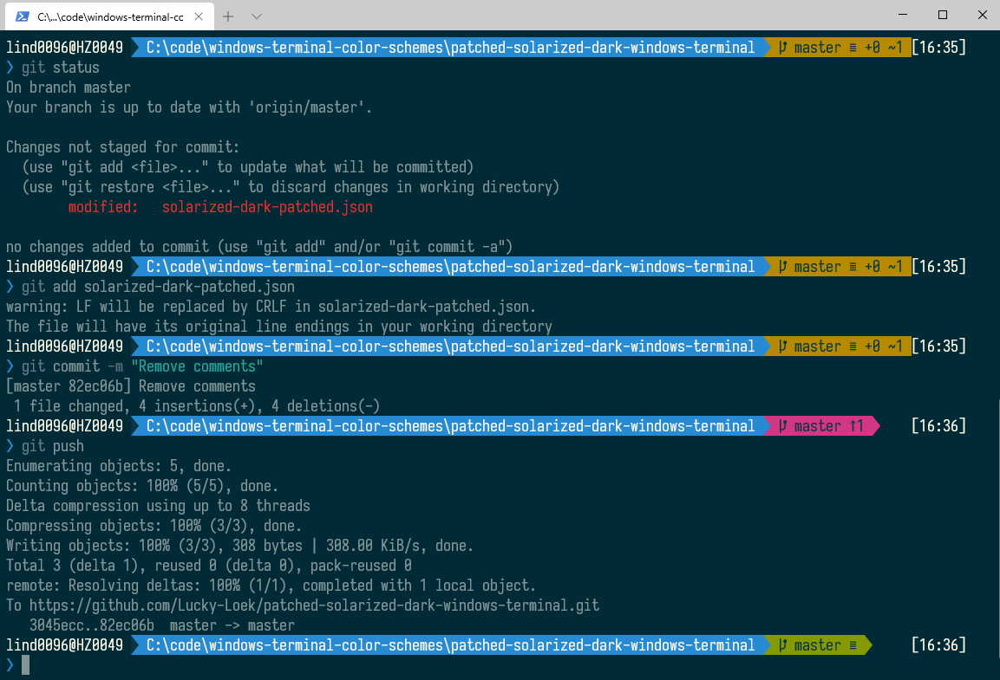

# Solarized Dark Patched for Windows Terminal

Using the built-in solarized dark color scheme, I would notice that options and arguments for commands would be invisible since they were rendered with the background color. This color scheme fixes that. See below screenshot where  you can clearly see the `-m` when committing.

